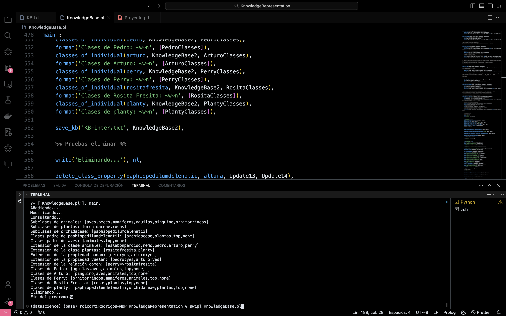

# Knowledge Representation in Prolog

Author: Rodrigo S. Cortez Madrigal

This project provides a Prolog-based knowledge base management system. It allows for the representation, querying, addition, modification, and deletion of classes, objects, properties, and relations within a hierarchical structure.

## Knowledge Representation

### Class Structure

- `class(ClassName, ParentClass, PropertyList, RelationList, ObjectList)`: Represents a class in the knowledge base.
    - `ClassName`: The name of the class.
    - `ParentClass`: The parent class of the class.
    - `PropertyList`: A list of properties associated with the class.
    - `RelationList`: A list of relations associated with the class.
    - `ObjectList`: A list of objects belonging to the class.

### Prolog Built-in Predicates

- `findall`: Finds all solutions to a query.
- `member`: Checks if an element is a member of a list.
- `append`: Concatenates lists.
- `select`: Removes an element from a list.
- `exclude`: Removes elements from a list that satisfy a condition.

## Predicates

### Auxiliary Predicates

#### `subclasses_of`

Finds all subclasses of a given class.

- Arguments:
    - `Class`: The class for which to find subclasses.
    - `KnowledgeBase`: The knowledge base containing class definitions.
    - `Subclasses`: The resulting list of all subclasses of `Class`.

#### `parentclasses_of`

Finds all parent classes of a given subclass recursively.

- Arguments:
    - `Subclass`: The subclass for which to find parent classes.
    - `KnowledgeBase`: The knowledge base containing class definitions.
    - `ParentClasses`: The resulting list of all parent classes of `Subclass`.

#### `objects_of_class`

Finds all objects of a given class.

- Arguments:
    - `Class`: The class for which to find objects.
    - `KnowledgeBase`: The knowledge base containing class definitions.
    - `Objects`: The resulting list of all objects of `Class`.

### Query Predicates

#### `class_extension`

Finds the extension of a class, including all objects belonging to the class and its subclasses.

- Arguments:
    - `Class`: The class for which to find the extension.
    - `KnowledgeBase`: The knowledge base containing class definitions.
    - `Extension`: The resulting list of all objects in the class extension.

#### `property_extension`

Finds the extension of a property, showing all objects that have a specific property.

- Arguments:
    - `Property`: The property for which to find the extension.
    - `KnowledgeBase`: The knowledge base containing class definitions.
    - `Extension`: The resulting list of objects and their property values.

#### `relation_extension`

Finds the extension of a relation, showing all objects that have a specific relation.

- Arguments:
    - `Relation`: The relation for which to find the extension.
    - `KnowledgeBase`: The knowledge base containing class definitions.
    - `Extension`: The resulting list of objects and their related targets.

#### `classes_of_individual`

Finds all classes to which an individual object belongs.

- Arguments:
    - `Individual`: The object for which to find classes.
    - `KnowledgeBase`: The knowledge base containing class definitions.
    - `Classes`: The resulting list of all classes to which `Individual` belongs.

### Addition Predicates

#### `add_class`

Adds a new class to the knowledge base.

- Arguments:
    - `NewClass`: The name of the new class.
    - `Father`: The parent class of the new class.
    - `KnowledgeBase`: The current knowledge base.
    - `NewKnowledgeBase`: The updated knowledge base with the new class.

#### `add_object`

Adds a new object to a class in the knowledge base.

- Arguments:
    - `Object`: The name of the new object.
    - `Class`: The class to which the object belongs.
    - `KnowledgeBase`: The current knowledge base.
    - `NewKnowledgeBase`: The updated knowledge base with the new object.

#### `add_class_property`

Adds a property to a class.

- Arguments:
    - `Class`: The class to which the property is added.
    - `Property`: The name of the property.
    - `Value`: The value of the property.
    - `KnowledgeBase`: The current knowledge base.
    - `NewKnowledgeBase`: The updated knowledge base with the new property.

#### `add_object_property`

Adds a property to an object.

- Arguments:
    - `Object`: The object to which the property is added.
    - `Property`: The name of the property.
    - `Value`: The value of the property.
    - `KnowledgeBase`: The current knowledge base.
    - `NewKnowledgeBase`: The updated knowledge base with the new property.

#### `add_class_relation`

Adds a relation to a class.

- Arguments:
    - `Class`: The class to which the relation is added.
    - `Relation`: The name of the relation.
    - `Target`: The target of the relation.
    - `KnowledgeBase`: The current knowledge base.
    - `NewKnowledgeBase`: The updated knowledge base with the new relation.

#### `add_object_relation`

Adds a relation to an object.

- Arguments:
    - `Object`: The object to which the relation is added.
    - `Relation`: The name of the relation.
    - `Target`: The target of the relation.
    - `KnowledgeBase`: The current knowledge base.
    - `NewKnowledgeBase`: The updated knowledge base with the new relation.

### Deletion Predicates

#### `delete_class`

Deletes a class from the knowledge base.

- Arguments:
    - `Class`: The name of the class to delete.
    - `KnowledgeBase`: The current knowledge base.
    - `NewKnowledgeBase`: The updated knowledge base without the class.

#### `delete_object`

Deletes an object from a class in the knowledge base.

- Arguments:
    - `Object`: The name of the object to delete.
    - `Class`: The class from which the object is deleted.
    - `KnowledgeBase`: The current knowledge base.
    - `NewKnowledgeBase`: The updated knowledge base without the object.

#### `delete_class_property`

Deletes a property from a class.

- Arguments:
    - `Class`: The class from which the property is deleted.
    - `Property`: The name of the property to delete.
    - `KnowledgeBase`: The current knowledge base.
    - `NewKnowledgeBase`: The updated knowledge base without the property.

#### `delete_object_property`

Deletes a property from an object.

- Arguments:
    - `Object`: The object from which the property is deleted.
    - `Class`: The class to which the object belongs.
    - `Property`: The name of the property to delete.
    - `KnowledgeBase`: The current knowledge base.
    - `NewKnowledgeBase`: The updated knowledge base without the property.

#### `delete_class_relation`

Deletes a relation from a class.

- Arguments:
    - `Class`: The class from which the relation is deleted.
    - `Relation`: The name of the relation to delete.
    - `KnowledgeBase`: The current knowledge base.
    - `NewKnowledgeBase`: The updated knowledge base without the relation.

#### `delete_object_relation`

Deletes a relation from an object.

- Arguments:
    - `Object`: The object from which the relation is deleted.
    - `Class`: The class to which the object belongs.
    - `Relation`: The name of the relation to delete.
    - `KnowledgeBase`: The current knowledge base.
    - `NewKnowledgeBase`: The updated knowledge base without the relation.

### Modification Predicates

#### `change_class_name`

Changes the name of a class.

- Arguments:
    - `OldName`: The current name of the class.
    - `NewName`: The new name for the class.
    - `KnowledgeBase`: The current knowledge base.
    - `NewKnowledgeBase`: The updated knowledge base with the new class name.

#### `change_object_name`

Changes the name of an object.

- Arguments:
    - `OldName`: The current name of the object.
    - `NewName`: The new name for the object.
    - `KnowledgeBase`: The current knowledge base.
    - `NewKnowledgeBase`: The updated knowledge base with the new object name.

#### `change_value_class_property`

Changes the value of a property of a class.

- Arguments:
    - `Class`: The class whose property value is to be changed.
    - `Property`: The name of the property.
    - `NewValue`: The new value for the property.
    - `KnowledgeBase`: The current knowledge base.
    - `NewKnowledgeBase`: The updated knowledge base with the new property value.

#### `change_value_object_property`

Changes the value of a property of an object.

- Arguments:
    - `Object`: The object whose property value is to be changed.
    - `Property`: The name of the property.
    - `NewValue`: The new value for the property.
    - `KnowledgeBase`: The current knowledge base.
    - `NewKnowledgeBase`: The updated knowledge base with the new property value.

#### `change_value_class_relation`

Changes the target of a relation of a class.

- Arguments:
    - `Class`: The class whose relation target is to be changed.
    - `Relation`: The name of the relation.
    - `NewTarget`: The new target for the relation.
    - `KnowledgeBase`: The current knowledge base.
    - `NewKnowledgeBase`: The updated knowledge base with the new relation target.

#### `change_value_object_relation`

Changes the target of a relation of an object.

- Arguments:
    - `Object`: The object whose relation target is to be changed.
    - `Relation`: The name of the relation.
    - `NewTarget`: The new target for the relation.
    - `KnowledgeBase`: The current knowledge base.
    - `NewKnowledgeBase`: The updated knowledge base with the new relation target.

## Main Predicate

### `main/0`

The main predicate initializes the knowledge base, performs various operations (addition, modification, deletion), and saves the updated knowledge base.

- Steps:
    1. Load the I/O module.
    2. Load the initial knowledge base from `KB.txt`.
    3. Perform addition operations.
    4. Perform modification operations.
    5. Save the updated knowledge base.
    6. Perform query operations.
    7. Perform deletion operations.
    8. Save the final knowledge base.
    9. Terminate the program.

## Running the Program

